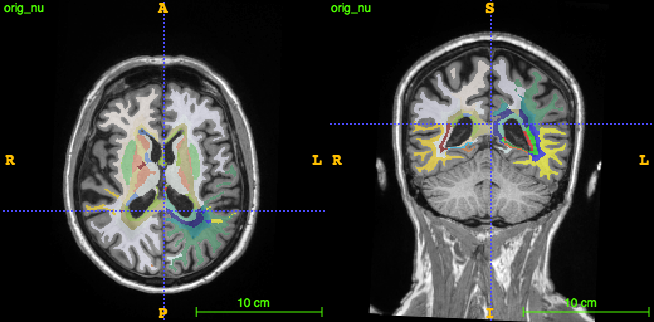
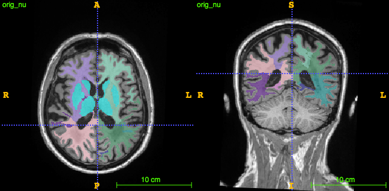
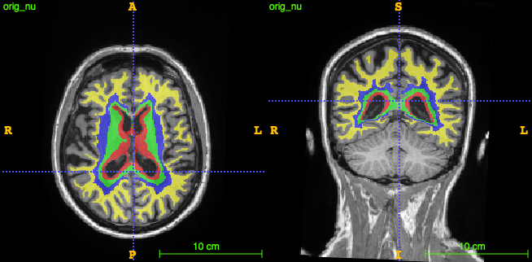

# bullseye pipeline
Pipeline for creating a _bullseye parcellation_ of the cerebral whiter matter using part of the FreeSurfer output and commands.
It provides an (anatomy-independent) spatial localization based on an radial component (ie, lobes) and a depth component.
It can be used to obtain region-specific quantification of white matter parameters (eg, a similar approach has been used to quantify regional white matter hyperintensity load in [this](https://link.springer.com/chapter/10.1007/978-3-030-00919-9_10) and [this](https://doi.org/10.1016/j.neurad.2017.10.001) papers). 

This document explains how to use the package.
The internals of the process are explained in [this](https://gsanroma.github.io/posts/2019/06/bullseye-parcellation/) blog post.

- the _bullseye parcellation_ is the intersection of a _lobar_ parcellation and a _depth_ parcellation

- the _lobar parcellation_ consists of 4 lobes per hemisphere (_frontal_, _parietal_, _temporal_ and _occipital_) + 1 consisting of the basal ganglia and thalamus as an additional region: (4*2) + 1 = 9 lobes

- the _depth parcellation_ consists of 4 equidistant parcels spanning from the surface of the ventricles to the internal surface of the cortex

## requirements
- a working `FreeSurfer 6.0.0` installation
- `Python 2.7` (with packages `nibabel`, `nipype`, `numpy` and `scipy`)

## installation

After cloning the repository, install the pipeline with `python setup.py install`

When the pipeline is installed, it can then be executed from the command line as `run_bullseye_pipeline -h / [ARGS]`

## arguments

`run_bullseye_pipeline` accepts the following arguments:

- `-s`, `--scansdir`: scans directory with the data for each subject (_mandatory_)
- `-w`, `--workdir`: work directory where data will be processed' (_mandatory_)
- `-o`, `--output_dir`: output directory where results will be stored (_mandatory_)
- `--subjects`: one or more subject IDs (space separated)
- `-b`, `--debug`: debug mode (saves the pipeline graph in the _work directory_)
- `-p`, `--processes`: overall number of parallel processes
- `-n`, `--name`: pipeline workflow name (default='bullseye_pipeline')

## scans directory

The pipeline can be run by passing an input scans directory following the FreeSurfer structure (typically pointed by `SUBJECTS_DIR`).
However, not all the FreeSurfer output is required.
The following is the _mandatory_ portion of FreeSurfer data that is required by the pipeline:

- `scansdir`  
  - `subject-id1`  
    - `mri`  
      - `aseg.mgz`  
      - `ribbon.mgz`  
    - `label`  
      - `lh.aparc.annot`  
      - `rh.aparc.annot` 
    - `surf`  
      - `lh.white`  
      - `rh.white`  
      - `lh.pial`  
      - `rh.pial`  
  - `subject-id2`  
  ...
  
## output directory structure

After execution of the pipeline a directory `output_dir` is created with the following structure:

- `output_dir`  
  - `subject-id1`  
    - `bullseye_wmparc.nii.gz`  
    - `lobes_wmparc.nii.gz`  
    - `shells_wmparc.nii.gz`
  - `subject-id2`  
  ...
  
containing, respectively, the final bullseye parcellation, and the lobar and depth parcellations used to create it.   

